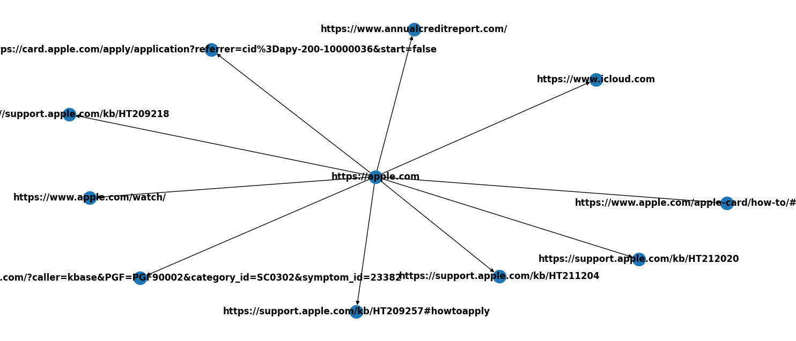
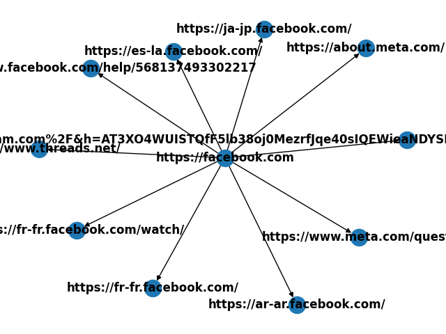
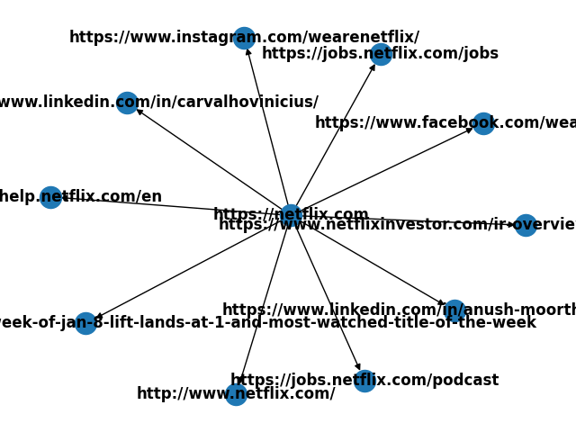

# Web Network Topology Mapper

It is a web scraping tool to create a topological map of website links 

## Dependencies

- matPlotLib
- beautfiulsoup4
- networkX
- requests

Use the package manager [pip](https://pip.pypa.io/en/stable/) to install dependecies

```bash
pip install requests
pip install beautifulsoup4
pip install networkx
pip install matplotlib
```
## Usage

Max links per website is set to 10 for to prevent unnecessary load on target adress

```bash
python main.py https://apple.com
```
```bash
python main.py https://facebook.com
```
```bash
python main.py https://netflix.com
```

## Screenshots







## License

[MIT](https://choosealicense.com/licenses/mit/)
